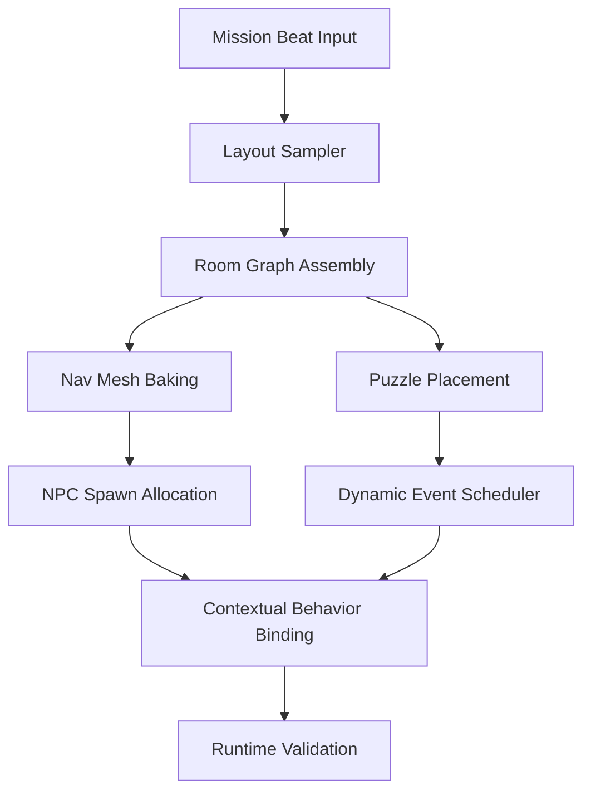

# Protocol EMR: NPC and Procedural Playbook

## Purpose and Scope
This document aligns the NPC framework with the procedural room system for the EMR experience. It defines how characters are spawned, think, perceive, and converse, while rooms, puzzles, and events are remixed at runtime. The goal is a prototype that demonstrates dynamic NPCs reliably reacting to procedurally generated spaces without manual authoring per room.

---

## NPC Framework

### Spawning Rules
1. **Spawn Volume Contracts**
   - Each room prefab registers tagged spawn volumes (friendly, hostile, neutral, ambient props).
   - Volumes advertise capacity, required clear radius, and adjacency constraints (doorways, cover nodes, puzzle anchors).
2. **Mission-Driven Seeding**
   - Mission graph emits `NPCSeed` payloads (role, faction, difficulty, narrative importance).
   - Procedural system requests NPCs per room phase (entry, mid-mission, climax) and respects mission quotas.
3. **Dynamic Refill & Culling**
   - Despawn NPCs if their nav mesh tile becomes invalid after room mutation.
   - Refill waves triggered by narrator cues or puzzle state flips, with cooldown gating.

### Behavior Trees: Friendly vs. Hostile
| Layer | Friendly NPC Nodes | Hostile NPC Nodes | Mission Hooks |
| --- | --- | --- | --- |
| **High-Level Intent** | Assist player, guide, trade, co-op task linking | Patrol, ambush, hunt, defend puzzle macguffin | `MissionDirective` blackboard value selects tree root |
| **Context Selector** | Evaluate mission step, proximity to narrator cue, social needs | Evaluate threat level, cover availability, reinforcement timer | Room seed exposes `ContextTags` (e.g., `ritual`, `repair`, `alarm`) |
| **Action Leaves** | Lead-to objective, contextual emote, grant item, unlock puzzle hint | Flank, suppress, trigger trap, corrupt puzzle element | Behavior leaves emit `NarrationEvent` for VO lines |

Friendly NPCs bias toward **follow & support** decorators, while hostile trees bias toward **aggression & disruption** nodes. Blend trees can be switched mid-mission (e.g., corrupted ally) by swapping faction tag and reloading subtree.

### Perception Stack
- **Nav Mesh Awareness**: Query room tile costs to avoid newly blocked paths after procedural remix.
- **Stimuli Channels**: Sound (weapons, puzzle resonance), Sight (LoS cone per FOV), Puzzle State (subscribe to key sockets, runes, timers).
- **Memory Decay**: Short-term (seconds) for combat prompts; medium memory retains mission-critical knowledge (door codes) scoped to narrator scene.
- **Shared Blackboards**: Squad-level blackboard mirrors mission objectives so procedural rooms can broadcast new affordances without per-NPC scripting.

### Dialogue Hooks
- **Event-Driven Lines**: Each behavior leaf optionally fires `DialogueCue` with tags `[faction]/[emotion]/[missionStep]` consumed by narrator + NPC VO banks.
- **Contextual Fillers**: When room generator instantiates unique props (e.g., ancient terminal), it exposes `LoreNodes`; NPCs with matching `loreInterest` deliver bespoke lines.
- **Interrupt Handling**: Dialogue queues pause when combat priority > threshold, resuming with `state_recapped` lines referencing latest puzzle progress.

### Contextual Behaviors & Narrator Cues
1. Missions emit **Context Tokens** (e.g., `escort`, `investigate`, `defend`). NPC behaviors subscribe to tokens and switch micro-strategies.
2. Narrator cues can:
   - Trigger **behavior modifiers** (slow time, fearless mode, puzzle-focused mode).
   - Inject **ambient NPC scenes** (campfire, briefing) that must spawn in rooms satisfying layout tags (e.g., `atrium`).
3. Procedural mutations broadcast `RoomDelta` events so NPCs know when to re-path, re-emote, or re-seed dialogue about the change.

---

## Procedural Generation Strategy

### Pipeline Overview

### Room Layouts
- **Room Archetypes**: `Hub`, `Corridor`, `Puzzle Vault`, `Boss Arena`, `Safe Room` with parameters for size, verticality, sightlines.
- **Connectivity Rules**: Use weighted grammar to ensure at least one alternate route for every critical room to encourage flanking behaviors.
- **Nav Mesh Streaming**: After assembling room graph, bake per-chunk nav data and stream tiles as player advances to keep NPC pathing valid.

### Puzzle Placement
- **Anchor Slots**: Each room exposes puzzle anchor sockets with difficulty + interaction type.
- **Constraint Solver**: Avoid repeating puzzle archetype within 2 rooms, ensure clue distribution across earlier rooms.
- **NPC Integration**: Puzzles flag whether they allow NPC assistance (friendly NPCs can hint, hostiles can sabotage by resetting states).

### Dynamic Events
- **Event Types**: Environmental (collapse, gas leak), Narrative (narrator interjection, flashback), Combat (reinforcements, stealth patrol).
- **Trigger Sources**: Time-based, player action, mission milestone, or random injection respecting fatigue budget.
- **Impact on NPCs**: Re-run spawn allocator, push new behaviors (e.g., hostiles retreat during collapse), refresh dialogue hooks.

### Runtime Variation & Validation
- Every generated room is scored against **Variation Budget** (layout diversity, puzzle novelty, NPC mix).
- Failures trigger regeneration of the affected stage before player entry.
- Validation pass ensures nav mesh coverage, sufficient spawn volume counts, and puzzle solvability.

---

## Required Engine Systems
| System | Responsibility | Notes |
| --- | --- | --- |
| Navigation Mesh Service | Streamable nav tiles per room, async rebake when geometry mutates | Provide callbacks so NPCs can replan instantly |
| Spawn Volume Manager | Registers, tags, and resolves spawn requests; enforces capacity | Must support weighted random + deterministic mission seeds |
| Runtime Variation Controller | Tracks variation budget, seeds RNG per mission, logs chosen combos | Exposes data to analytics for balancing |
| Mission Context Broker | Shares mission tokens, directives, and narrator cues with NPC blackboards | Needs priority system to resolve conflicting cues |
| Dialogue & Narration Router | Maps behavior events to VO assets, handles interruptions | Integrates with localization + subtitle queue |

---

## Prototype Acceptance Criteria
1. **Procedural Room Variety**
   - Minimum of three archetypes generated per run with distinct layout seeds.
   - Nav mesh tiles stream correctly; NPCs never get stuck due to missing navigation data.
2. **NPC Spawn & Behavior**
   - Friendly and hostile NPCs spawn from tagged volumes according to mission directives.
   - Behavior trees react to room context tags (e.g., friendly NPC offers hint in puzzle room, hostile switches to ambush in corridor).
3. **Perception & Dialogue**
   - NPCs perceive at least two stimulus channels (sound + puzzle state) and react appropriately.
   - Dialogue cues trigger narrator responses reflecting current mission step.
4. **Dynamic Events**
   - At least one runtime event (environmental or combat) alters room conditions and NPC behaviors adapt (re-path, change dialogue, or spawn reinforcements).
5. **Validation Telemetry**
   - Prototype logs variation metrics (rooms generated, puzzle mix, NPC composition) and reports pass/fail state before player entry.

Meeting all criteria demonstrates dynamic NPCs coherently inhabiting procedurally varied rooms under the Protocol EMR framework.
